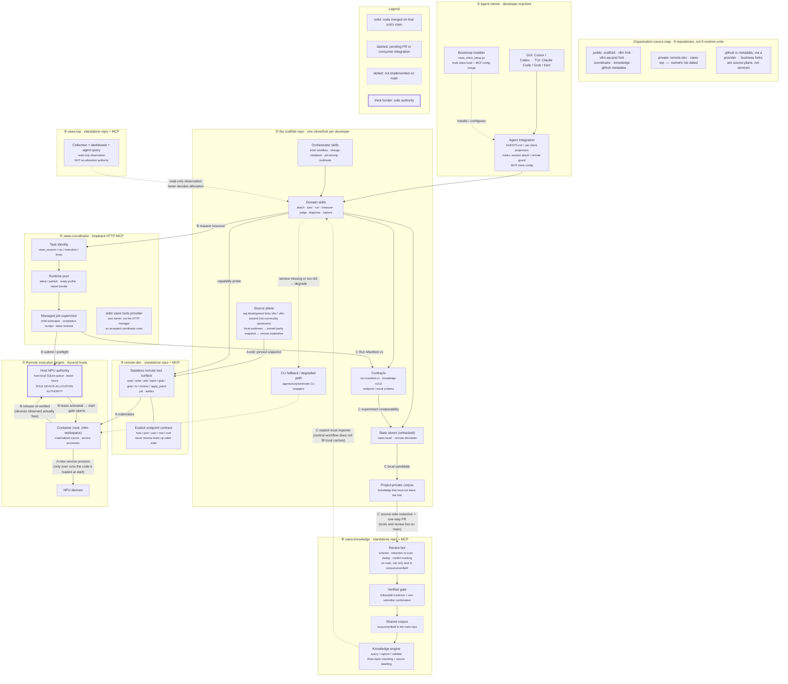

# VAWS architecture map

Target-state map of the `vllm-ascend-workspace` organization, organized by
**deployment unit** — the thing that ships and versions on its own. Layering is
secondary here on purpose: the reason this project is being split into separate
repos is that these units are independently released, so "which unit owns this"
is the question a reader actually has.

This file replaces an ad-hoc Mermaid file that used to be passed around as a
loose attachment. It is maintained here. Keep the fenced `mermaid` block below
as the single source of the diagram — there is deliberately no second `.mmd`
copy to drift out of sync.

The organization has **eight repositories** and **seven deployment units**.
Repository count is not runtime-unit count. The two public organization
development forks live in the scaffold source plane; they are not extra
services. `.github` is organization metadata, not a provider. Six
repositories are public; `remote-dev` and `vaws-top` remain private. That
visibility count is from fresh public metadata plus Root's authenticated
All/no-filter eight-row organization inventory; private numeric metadata
remains explicitly dated.

Current deployment-unit rows, the diagram labels and the compact source map
were checked on **2026-09-08** against the verified eight-repository identity
map and the cited acceptance evidence. They distinguish repository exists,
code merged on `main`, PR pending, deployed service, and tested behavior. An
open PR or a passing check is none of the last three. The dated 2026-09-07
"What is actually built" table remains historical evidence at its named old
SHAs and is superseded by the current source map.

## Deployment units

| # | Unit | Ships as | Runs on | Status (2026-09-08) |
|---|---|---|---|---|
| ① | Agent clients + integration | not shipped — per-developer config, generated by the scaffold's bootstrap installer | developer machine | shipped |
| ② | The scaffold (`vllm-ascend-workspace`) | one clone/fork per developer | developer machine | shipped as [`vllm-ascend-workspace/vllm-ascend-workspace`](https://github.com/vllm-ascend-workspace/vllm-ascend-workspace) (id 1196723340, public non-fork; `main` `7af4ac31`, tree `16f1073`); same-id transfer complete; consumes remote-dev, coordinator, and the first-stage vaws-top locator; boundary baseline accepted rows: **zero**; not installed-runtime or hardware evidence |
| ③ | `vaws-coordinator` | loopback HTTP MCP service, one shared manager process; stdio `vaws_*` provider is a separate server | a machine the developers can reach over loopback or an SSH tunnel | [`vaws-coordinator`](https://github.com/vllm-ascend-workspace/vaws-coordinator) exists (public); accepted `main` `2e16e894` has the HTTP manager, pool, jobs **and** the stdio `vaws_*` provider ([#2](https://github.com/vllm-ascend-workspace/vaws-coordinator/pull/2) merged); hardware-level guarantees **not established** |
| ④ | `remote-dev` | stdio MCP server + CLI fallbacks | developer machine, talks SSH outward | [`remote-dev`](https://github.com/vllm-ascend-workspace/remote-dev) exists (private / access-limited); accepted `main` `b6acc21d` has the tool surface, including glob/Python 3.9 compatibility and a narrow mux interruption path; scaffold consumer is on accepted `main`; issues [#1](https://github.com/vllm-ascend-workspace/remote-dev/issues/1) and [#2](https://github.com/vllm-ascend-workspace/remote-dev/issues/2) remain **open**; mux isolates the deliberate interruption path only and does not promise universal ControlMaster failure isolation or a new hardware replay; live SSH re-validation of the standalone tree **not claimed** |
| ⑤ | `vaws-top` | loopback web UI + API, plus a read-only stdio MCP | developer machine or a bastion; systemd user service or a Windows scheduled task | [`vaws-top`](https://github.com/vllm-ascend-workspace/vaws-top) exists (private / access-limited; numeric id dated); `main` `e1347848` has collection, dashboard and read-only MCP; observation only; **not** a device-allocation authority; first-stage scaffold locator present; not claimed deployed |
| ⑥ | `vaws-knowledge` | Git repo + knowledge MCP engine; review bot on `main` | GitHub, plus a local engine per consumer | [`vaws-knowledge`](https://github.com/vllm-ascend-workspace/vaws-knowledge) exists (public); accepted `main` `1eac65cf` (tree `1926b620`; Stage 2 [#9](https://github.com/vllm-ascend-workspace/vaws-knowledge/pull/9) merged) has schema, `tools/` `server/` `sync/` `conformance/` and the deterministic review bot; central collection/proposal/advisory/snapshot **source** is on `main`; corpus directories still empty placeholders; bot approval is not verified qualification; a central workflow is not a local cache refresh |
| ⑦ | Remote execution targets | not shipped — physical Ascend hosts and their containers | Ascend hardware | shipped |

Unit ⑦ is in the map because two of the three flows terminate there and because
it holds the one authority nothing else may duplicate.

The coordinator's local-first `vaws_*` provider is its **own stdio MCP
server**, separate from the loopback HTTP pool manager. That stdio server is
on accepted `vaws-coordinator` `main` `2e16e894` (PR
[#2](https://github.com/vllm-ascend-workspace/vaws-coordinator/pull/2)
merged). Accepted stdio is newline-delimited JSON (legacy Content-Length
may also work). Capability authority is `capabilities.experimental`, not
undocumented `serverInfo` fields. Hardware-level guarantees are not
established. The coordinator reaches `remote-dev` only through explicit
endpoint fields; it does not ask the substrate to resolve an alias, session
or machine.

## Map



`KSHARE` is dotted because `corpus/verified/` and `corpus/unverified/` still
contain only `.gitkeep` placeholders. The engine, redaction tools, federation
sync, conformance kit and deterministic review bot are on `main`. An empty
verified-layer snapshot is not a nonempty corpus and is not qualification.
The review bot can only land entries in `corpus/unverified/`; verified
publication still needs followable evidence and non-submitter confirmation.
Coordinator stdio is on accepted `main` and is no longer a pending node.

## The three flows

### A · Edit flow — local edit to a running service

A running service only ever executes the code it loaded at start. There is no
hot reload, no in-place patch of a live worker. Every code change therefore ends
in a new process, and the flow exists to make that cheap and unambiguous.

1. **Local worktree.** Edits happen on the developer machine, across the
   scaffold and its `vllm` / `vllm-ascend` submodule worktrees. The
   organization development forks
   [`vllm-ascend-workspace/vllm`](https://github.com/vllm-ascend-workspace/vllm)
   and
   [`vllm-ascend-workspace/vllm-ascend`](https://github.com/vllm-ascend-workspace/vllm-ascend)
   sit in this source plane; they are not replacement community upstreams
   and not extra deployment units.
2. **Pinned snapshot.** Parity turns the working tree — *including uncommitted
   edits* — into a synthetic commit and publishes the Git objects into a
   container-local cache. Content is hashed, so a later edit to the same dirty
   file is picked up. Publishing objects is not materializing them.
3. **Materialize.** A separate explicit step moves the runtime source tree to
   that snapshot. The running source tree stays fixed until this happens.
   Materialize updates source only; it neither installs nor compiles.
4. **New service process.** Start a new owned service against the materialized
   snapshot. Reusing a native build output is only valid while its
   source/build/environment identity still matches.

Consequences worth stating because they get violated: "run one command on the
remote box" is a zero-sync operation and must not be routed through parity;
and editing after a launch does not affect the launched service — it needs a
new execution.

### B · Resource flow — agent to an exclusive NPU lease

1. **Agent → coordinator.** A domain skill asks for a resource through the task
   facade (`vaws_session` / `vaws_run`). Task identity is local and works
   offline; only remote work needs the manager.
2. **Runtime pool checkout.** The coordinator hands back an *already prepared*
   container and environment as an exclusive binding, with reserved service
   ports. A cache miss returns a waiting/miss result — it does not silently
   provision, install or compile. Preparation is an explicit operator action.
3. **Host NPU authority.** The coordinator *submits* to the host queue. It does
   not allocate. The host holds the queue, the lease and the fence.
4. **Lease → start gate.** The manager prepares a waiting supervisor, verifies
   its host PID, activates the host lease, and only then opens the start gate.
   A live marked process keeps its allocation during CPU-side initialization
   even though no NPU process is visible yet.
5. **Verified release.** Stopping signals only the recorded process family. The
   host must then observe every leased device free across repeated samples, and
   the container is re-verified before reuse. Unknown ownership retains
   resources; a client timeout is never read as successful cleanup.

Failure posture is fail-closed: a supervisor that vanishes without a completion
receipt leaves the execution `unknown` and the lease protected until ownership
is reconciled with explicit, recorded evidence.

### C · Evidence flow — a run to a fact somebody else can reuse

1. **Run → Run Manifest v1.** Every cross-workflow run emits a manifest under
   untracked local state. A released allocation is not a passing run; domain
   workflows attach their own acceptance evidence.
2. **Manifest → comparability.** Manifests carry environment and source
   identity, which is what makes two runs comparable. Two results differing in
   more than one dimension cannot be attributed to either — the same confounder
   rule the knowledge corpus uses for conflicts.
3. **Candidate.** At the moment a fix is confirmed, it is captured locally as an
   unreviewed single-observation candidate, then into the fork's project layer.
4. **Redact at the source, then one PR.** Redaction runs in the contributing
   fork *before* anything reaches a PR. The schema is the egress whitelist
   (`additionalProperties: false` everywhere), so an undeclared field cannot
   leave. The main repo re-scans as a second line of defence, not the first.
   The redaction tools, export gate and validator are on
   `vaws-knowledge` `main` (PR [#1](https://github.com/vllm-ascend-workspace/vaws-knowledge/pull/1)).
   Scaffold export/migration onto that contract landed as
   [#84](https://github.com/vllm-ascend-workspace/vllm-ascend-workspace/pull/84)
   on accepted scaffold `main` `7af4ac31`. Two migrated v2 entries remain
   unverified with unresolved required dimensions and are export-blocked;
   nine model facts remain v1. That is not a nonempty verified corpus.
5. **Bot, then a human.** The bot can gate schema, redaction re-scan, exact and
   near duplicates, coordinate conflicts, id/hash integrity. It cannot decide
   whether a claim is true, so bot approval alone only reaches
   `corpus/unverified/`. `corpus/verified/` additionally needs a followable
   evidence reference and confirmation from someone who is not the submitter.
   Bot validation and conflict marking do not prove technical truth. The
   deterministic review bot is on `vaws-knowledge` `main` (PR
   [#5](https://github.com/vllm-ascend-workspace/vaws-knowledge/pull/5)
   merged). Stage 2 central collection, proposal, advisory wiring and
   verified snapshot operations are on `main` (PR
   [#9](https://github.com/vllm-ascend-workspace/vaws-knowledge/pull/9)
   merged). There is no `CODEOWNERS` file claimed on `vaws-knowledge`
   `main`; protection settings were not read, and are not claimed.
6. **Back into queries.** A central knowledge workflow does not populate
   another developer's local cache. The consumer boundary remains the
   explicit local importer
   (`.agents/scripts/knowledge_shared_cache.py import --from ...
   --source-repo ... --source-ref ...`). Query results are labelled by
   layer, and entries that go too long without re-verification come back as
   `stale` with a warning rather than silently confident. Shared / project /
   candidate are trust layers, distinct from the verified / unverified
   review zones.

Direction is one-way per layer, by design: forks propose upward, the main repo
publishes downward. There is no merge algorithm.

## Trust boundaries

| Boundary | Where | Property |
|---|---|---|
| Loopback-only services | ③ `vaws-coordinator` (bound to loopback, bearer token per principal, Host/Origin checks on), ⑤ `vaws-top` (web + API bound to loopback, **no login at all**) | Neither is safe to expose. `vaws-top` has no authentication, so a port-forward or reverse proxy in front of it is a full disclosure of the fleet. Remote access to either is authenticated SSH forwarding, not a public listener. |
| SSH + remote root | ④ → ⑦ | This is where the substrate stops being a local tool. `remote-dev` defaults to `root=/` — full remote path permission — and containers run as root at `/vllm-workspace`. Narrowing is opt-in by passing an explicit `root`. |
| Cooperative fence | ③ and the host queue | Enforced only for participants. Direct SSH, unmanaged containers and plain remote-dev writes are outside it. |
| Public, unrecallable | ⑥'s PR entrance | Public Git history cannot be recalled. This is why redaction is a source-side gate and why widening any schema object is a privacy decision, not a schema change. |
| Secrets never in tracked files | all units | Coordinator access files, tokens, machine inventories and monitor keys live in untracked local state, mode `0600` where applicable. `vaws-top` passes a bootstrap password through stdin for the duration of one request and stores it nowhere. |

## Authority rules

These are the rules most likely to be broken once the code lives in separate
repos, because each repo will look locally correct while breaking one.

1. **The host NPU queue is the sole device-allocation authority.** It lives on
   each physical Ascend host and owns tasks, queue, fences, activation and
   release. The coordinator submits and waits; it does not allocate. No second
   allocator may be introduced — in particular, the legacy session-local lease
   file is a compatibility mechanism, not a cross-workspace allocator, and the
   pool path deliberately does not create a second local lease. A monitor is
   never authority to kill, lease, or release devices.
2. **`vaws-top` is observation-only and must never decide an allocation.** It
   is a read-only collector: no task launch, no container creation, no NPU
   lease. Its "idle" answer is a cache with an age, derived from `npu-smi`, a
   process table and an HBM fallback threshold. It is legitimate for narrowing
   a search or for a human to look at. It is not a claim on a device, and a
   device that reads idle there can be leased by someone else in the same
   second.
3. **An MCP fence is a cooperative mechanism, not an OS access-control
   boundary.** It coordinates participants who choose to participate. It cannot
   stop a process, and accepting a yield request does not release a device.
   Coordination messages carry sender identity but are untrusted text — not
   commands, and not permission to stop a peer. Direct root SSH and
   loopback/state boundaries remain the actual control edges.
4. **Contract ownership follows the unit.** The unit that defines a schema owns
   it. `remote-dev` owns the endpoint/result contract; the coordinator owns task
   and execution contracts; the scaffold owns Run Manifest v1;
   `vaws-knowledge` owns the knowledge schema. A consumer does not extend a
   producer's contract in its own repo.
5. **Dependency direction is one-way.** `remote-dev` is stateless and must not
   import a consumer's private state. It accepts explicit endpoint fields only.
   Workspace / session / alias discovery belongs in the consumer resolver
   plugin. The coordinator consumes `remote-dev`, never the reverse.

## Current source map

Checked **2026-09-08** against the verified eight-repository identity/ref map
and the cited acceptance evidence. This compact map supersedes the dated
2026-09-07 snapshot below. Source `main` SHA, scaffold dependency pin,
accepted consumer wiring, installed runtime and hardware qualification remain
distinct facts.

Six repositories are public; `remote-dev` and `vaws-top` remain private.
Private numeric ids below are retained from earlier verified metadata; they
were not freshly re-read through a private API. The two business forks are
organization development forks, not replacement community upstreams, and not
extra deployment units.

| Repository | id | Visibility | Current `main` | Current role |
|---|---:|---|---|---|
| [`vllm-ascend-workspace/vllm-ascend-workspace`](https://github.com/vllm-ascend-workspace/vllm-ascend-workspace) | 1196723340 | public, non-fork | `7af4ac3106649d2dbbed712c780a14db8bf25113` (tree `16f1073cc0df27354cabd100c4b9196ec99a756c`) | scaffold: domain skills + source plane; consumes remote-dev, coordinator, and the first-stage vaws-top locator; boundary baseline accepted rows: **zero** |
| [`vllm-ascend-workspace/vllm`](https://github.com/vllm-ascend-workspace/vllm) | 1009465986 | public fork | `a435e3108d82eb96d9b3954c1935afbbf4c5f69b` | organization development fork of [`vllm-project/vllm`](https://github.com/vllm-project/vllm) (id 599547518); **not** a replacement community upstream |
| [`vllm-ascend-workspace/vllm-ascend`](https://github.com/vllm-ascend-workspace/vllm-ascend) | 924147541 | public fork | `d52c1b8de956507e6ace7ba351a998ed5cee6ce5` | organization development fork of [`vllm-project/vllm-ascend`](https://github.com/vllm-project/vllm-ascend) (id 924058625); **not** a replacement community upstream |
| [`vllm-ascend-workspace/remote-dev`](https://github.com/vllm-ascend-workspace/remote-dev) | 1360023179 | private (numeric id dated) | `b6acc21d147e369e771f1ff916973d74d667691e` | transport and explicit endpoints; scaffold consumer on accepted `main`; issues [#1](https://github.com/vllm-ascend-workspace/remote-dev/issues/1) and [#2](https://github.com/vllm-ascend-workspace/remote-dev/issues/2) **open** |
| [`vllm-ascend-workspace/vaws-coordinator`](https://github.com/vllm-ascend-workspace/vaws-coordinator) | 1360026044 | public | `2e16e894e31a12d85a11117a2772031f30fdfebe` | task identity, runtime pool, managed worker; HTTP manager **and** stdio `vaws_*` provider on `main` |
| [`vllm-ascend-workspace/vaws-knowledge`](https://github.com/vllm-ascend-workspace/vaws-knowledge) | 1359978527 | public | `1eac65cf2f8ff4f1451c788f0964005ea0dfdee2` (tree `1926b6204c2bdffeaa00fb1707fdf30927eeffb0`) | formal knowledge source; Stage 2 [#9](https://github.com/vllm-ascend-workspace/vaws-knowledge/pull/9) merged; deterministic review bot on `main` |
| [`vllm-ascend-workspace/vaws-top`](https://github.com/vllm-ascend-workspace/vaws-top) | 1360023247 | private (numeric id dated) | `e13478484b9f52e8847169a785eebc32b268787f` | fleet monitoring; observation only; first-stage scaffold locator present; not a deployment claim |
| [`vllm-ascend-workspace/.github`](https://github.com/vllm-ascend-workspace/.github) | 1360014025 | public | this metadata repository | organization landing metadata, not a provider |

Current operational and consumer labels, not a rewrite of the historical
table:

- **Scaffold consumers.** Accepted remote-dev and coordinator wiring and the
  first-stage vaws-top locator are on scaffold `main` `7af4ac31`. Current
  boundary baseline accepted rows are zero. Same-id transfer to
  `vllm-ascend-workspace/vllm-ascend-workspace` is complete. This is source
  consumption, not installed-client, runtime or hardware evidence.
- **Coordinator stdio.** On accepted `main` `2e16e894`. Do not label it
  pending from the 2026-09-07 PR table. Hardware-level guarantees are not
  established. Direction is coordinator → explicit `remote-dev` endpoints.
- **Knowledge source vs pin vs cache.** Accepted public knowledge `main` is
  `1eac65cf`. Central collection, proposal, advisory and snapshot **source**
  is on that `main`. The scaffold's unchanged knowledge pin
  `e04d50f7bc5702afbe2e2988f7c28a3268e1a7f3` is a conformance test kit via
  `VAWS_KNOWLEDGE_KIT_ROOT`, not a runtime dependency and not this newer
  source `main`. A central workflow does not populate developers' local
  caches; the explicit local importer remains the consumer boundary.
- **Knowledge live bounds.** Preview
  [34144173739](https://github.com/vllm-ascend-workspace/vaws-knowledge/actions/runs/34144173739)
  independently PASSed: eligible 0, one controlled incomplete-scope refusal,
  parent + 35 accessible forks = 36 inspected repositories, fork-count
  discrepancy 1. That is not complete fork coverage and not a positive
  proposal path. Advisory status `unavailable`, reason `no eligible input`,
  `provider.called=false`; that does not prove actual Grok invocation. Root's
  bounded live acceptance of proposal
  [34145663787](https://github.com/vllm-ascend-workspace/vaws-knowledge/actions/runs/34145663787)
  and snapshot
  [34145761264](https://github.com/vllm-ascend-workspace/vaws-knowledge/actions/runs/34145761264)
  records proposal `nothing-to-propose`, `wrote=false` (positive candidate
  path not exercised) and a verified-layer snapshot with `entry_count=0`
  (empty manifest, not nonempty verified publication). Consumer cache
  refresh was not executed. Two scaffold v2 entries remain
  unverified/export-blocked; nine model facts remain v1.
- **remote-dev issues.** [#1](https://github.com/vllm-ascend-workspace/remote-dev/issues/1)
  and [#2](https://github.com/vllm-ascend-workspace/remote-dev/issues/2)
  remain **open**. Accepted current source contains glob/Python 3.9
  compatibility and a narrow mux interruption path. The mux change isolates
  the deliberate interruption path; it does not promise universal
  ControlMaster failure isolation or a new hardware replay.

## What is actually built

**Historical snapshot, checked 2026-09-07.** This dated table is retained as
evidence at the named old SHAs and PR states. It is superseded by the current
source map above. Do not read these rows as the present organization map.
The legend in this snapshot distinguished merged from pending from absent.
Full SHAs are in the Basis column. "On `main`" here means the named tree at
that SHA on that date. It does not mean deployed, and it does not mean a
hardware or client pass.

| Component | State | Basis |
|---|---|---|
| `remote-dev` repository | **exists** (private / access-limited) | [`vllm-ascend-workspace/remote-dev`](https://github.com/vllm-ascend-workspace/remote-dev); `main` `2ff116293f0959fb49efffedbbbf1444d78cbb30` (2026-09-07T09:21:50Z). Public clone was not verified; authenticated metadata was. |
| `remote-dev` tool surface, MCP server, CLI fallbacks, hook guards | merged on `remote-dev` `main` | `core/`, `mcp/`, `tools/`, `hooks/`, `schemas/` present at that SHA. Scaffold `main` `161fed1b0fe6b48359be3f0cf33bb7d8befae113` still has `.remote-dev/`. Consumer rewire is [#90](https://github.com/maoxx241/vllm-ascend-workspace/pull/90) (**open**, head `5ad2d9bd`). |
| `remote-dev` live SSH / hardware behavior | **not claimed** | Extraction commit states prior live evidence predates the standalone tree. [#3](https://github.com/vllm-ascend-workspace/remote-dev/pull/3) is **open** (CI green is not merged). |
| Coordinator repository | **exists** (public) | [`vllm-ascend-workspace/vaws-coordinator`](https://github.com/vllm-ascend-workspace/vaws-coordinator); `main` `f7c0682b6907c60418fa20ca4d9b3d3a46d26773` (2026-09-07T09:24:23Z). |
| Coordinator HTTP manager, runtime attest/publish, managed jobs | merged on `vaws-coordinator` `main` | `server.py`, `backend.py`, `prepare_runtime.py` present. Scaffold `main` still has `.agents/coordinator/`. [#1](https://github.com/vllm-ascend-workspace/vaws-coordinator/pull/1) is **open**. |
| Coordinator stdio `vaws_*` provider | **not on `main`** | [#2](https://github.com/vllm-ascend-workspace/vaws-coordinator/pull/2) **open**, head `91b8bf52`. No `mcp/` directory on `main`. |
| Coordinator hardware-level guarantees | **not established** | Control-plane CI is not hardware execution, native client lifecycle, service readiness, operator correctness or performance. |
| `vaws-top` repository | **exists** (private / access-limited) | [`vllm-ascend-workspace/vaws-top`](https://github.com/vllm-ascend-workspace/vaws-top); `main` `e13478484b9f52e8847169a785eebc32b268787f` (2026-09-07T09:22:57Z). |
| `vaws-top` collection, dashboard, history, read-only agent CLI/MCP | merged on `vaws-top` `main` | `app/`, `backend/`, `deploy/` present at that SHA. Observation only. Scaffold still has branch `vaws-top` at `372eba41`. Not claimed deployed. |
| `vaws-knowledge` schema, federation and lifecycle contracts | merged | schema and docs on `main` `5051b11597766d90284946b57a3246adede35527`. |
| `vaws-knowledge` source-side redaction, export gate, validator | merged | PR [#1](https://github.com/vllm-ascend-workspace/vaws-knowledge/pull/1) merged 2026-09-07T09:41:49Z (`8ce02d62`); `tools/redact.py`, `tools/export.py`, `tools/validate.py` on `main`. |
| `vaws-knowledge` retrieval engine (three trust layers) | merged | PR [#2](https://github.com/vllm-ascend-workspace/vaws-knowledge/pull/2) merged 2026-09-07T09:41:53Z (`5760cba1`); `server/mcp_server.py`, `server/query.py`, `server/layers.py` on `main`. Not claimed deployed. |
| `vaws-knowledge` federation sync | merged | PR [#3](https://github.com/vllm-ascend-workspace/vaws-knowledge/pull/3) merged 2026-09-07T09:41:58Z (`836f0c83`); `sync/` on `main`. |
| `vaws-knowledge` conformance kit | merged | PR [#4](https://github.com/vllm-ascend-workspace/vaws-knowledge/pull/4) merged 2026-09-07T09:42:02Z (`1dc027a0`); `conformance/` on `main`. A passing kit run is not a verified corpus entry. |
| `vaws-knowledge` review bot / promotion CI | **not on `main`** | `bot/` is `.gitkeep`. [#5](https://github.com/vllm-ascend-workspace/vaws-knowledge/pull/5) **open**, head `9cf5f779`. No `.github/` on `main`. |
| `vaws-knowledge` corpus | **empty** | `corpus/verified/` and `corpus/unverified/` contain only `.gitkeep`. |
| Scaffold → commons export bridge | **not on scaffold `main`** | scaffold still emits `knowledge-v1`; commons is `knowledge-v2`. Consumer is [#84](https://github.com/maoxx241/vllm-ascend-workspace/pull/84) (**open**; MCP/remote-safety checks were failing as of 2026-09-07T09:41Z). |
| Split ledger / comparability work | **not on scaffold `main`** | [#91](https://github.com/maoxx241/vllm-ascend-workspace/pull/91), [#92](https://github.com/maoxx241/vllm-ascend-workspace/pull/92), [#95](https://github.com/maoxx241/vllm-ascend-workspace/pull/95) are **open**. CI green is not merged. |
| Domain skills (serving, benchmark, memory profiling, profiling collection/analysis, correctness, regression, graph/distributed/operator debug, Triton lifecycle, PD serving) | implemented on scaffold `main` | present as skill packages with wrapper scripts at `161fed1b`. |
| Accuracy evaluation harness integration, computation-graph analysis, synchronization-stall optimization | planned | listed as roadmap, not delivered. |

### Where the sources disagree

**Historical observations from the 2026-09-07 snapshot above.** Recorded
rather than smoothed over. They are superseded by the current source map
and must not be rewritten as if they had always described the present
state:

- **The service repositories exist; scaffold `main` still has in-tree copies.**
  `remote-dev`, `vaws-top` and `vaws-coordinator` are real repositories (the
  first two private). Scaffold `main` `161fed1b` still contains `.remote-dev/`
  and `.agents/coordinator/`, and still has a `vaws-top` branch. Extraction of
  a repository and consumption of that repository are different stages.
  [#84](https://github.com/maoxx241/vllm-ascend-workspace/pull/84) /
  [#90](https://github.com/maoxx241/vllm-ascend-workspace/pull/90) /
  coordinator [#2](https://github.com/vllm-ascend-workspace/vaws-coordinator/pull/2)
  can stay open after the producer `main` exists.
- **`vaws-knowledge`'s README still describes the review bot in the present
  tense.** `tools/`, `server/`, `sync/` and `conformance/` now have real
  modules on `main`. `bot/` does not. Bot copy that reads as if the pipeline
  already runs is still ahead of `main`.
- **Knowledge contract version.** The scaffold `main` still emits
  `knowledge-v1` and `knowledge-candidate-v1`; the commons requires
  `knowledge-v2` with all twelve scope dimensions declared. Flow C is not
  closed end-to-end on the shipped scaffold until [#84](https://github.com/maoxx241/vllm-ascend-workspace/pull/84)
  merges. That PR is open, not merged.
- **Fleet-monitor ports.** Docs give the browser entry and the API as two
  different loopback ports, and a reader skimming one page may take either as
  "the" port. Both are correct: the UI proxies `/api/*` to the backend port.

## Out of scope

Marking the edges is more useful than listing capabilities, so these are stated
as boundaries of the current design, not as a backlog.

- **Multi-host gang allocation.** There is no atomic all-or-nothing allocation
  across several physical hosts. Multi-host work is sequenced by the caller and
  can partially acquire.
- **Runtime pool auto-replenishment.** The pool reuses runtimes an operator
  prepared. A cache miss surfaces as a miss. Nothing builds a container,
  installs a dependency or compiles inside a launch path.
- **Public OAuth / internet-facing authorization.** The coordinator is a
  private cooperative service with per-principal bearer tokens on loopback. It
  is not an authorization server, and `vaws-top` has no login at all.
- **Bidirectional knowledge merge.** Sync is one-way per layer. A fork never
  writes `verified/`; the main repo never writes into a fork. The rejected
  failure mode is silent overwrite of reviewed content.

Also deliberately absent: transparent adapters for every legacy domain wrapper,
relocatability of editable installs and native operator artifacts, and any
inference that a released allocation means a passing run.

## Verifying the diagram

The fenced `mermaid` block above is the source. To check it renders after an
edit, extract it and run Mermaid's CLI:

```bash
awk '/^```mermaid$/{f=1;next} /^```$/{f=0} f' docs/architecture.md > /tmp/arch.mmd
npx -y @mermaid-js/mermaid-cli -i /tmp/arch.mmd -o /tmp/arch.svg
```

A broken diagram on the organization profile is worse than no diagram, so treat
a render failure as a blocking error on the PR.
