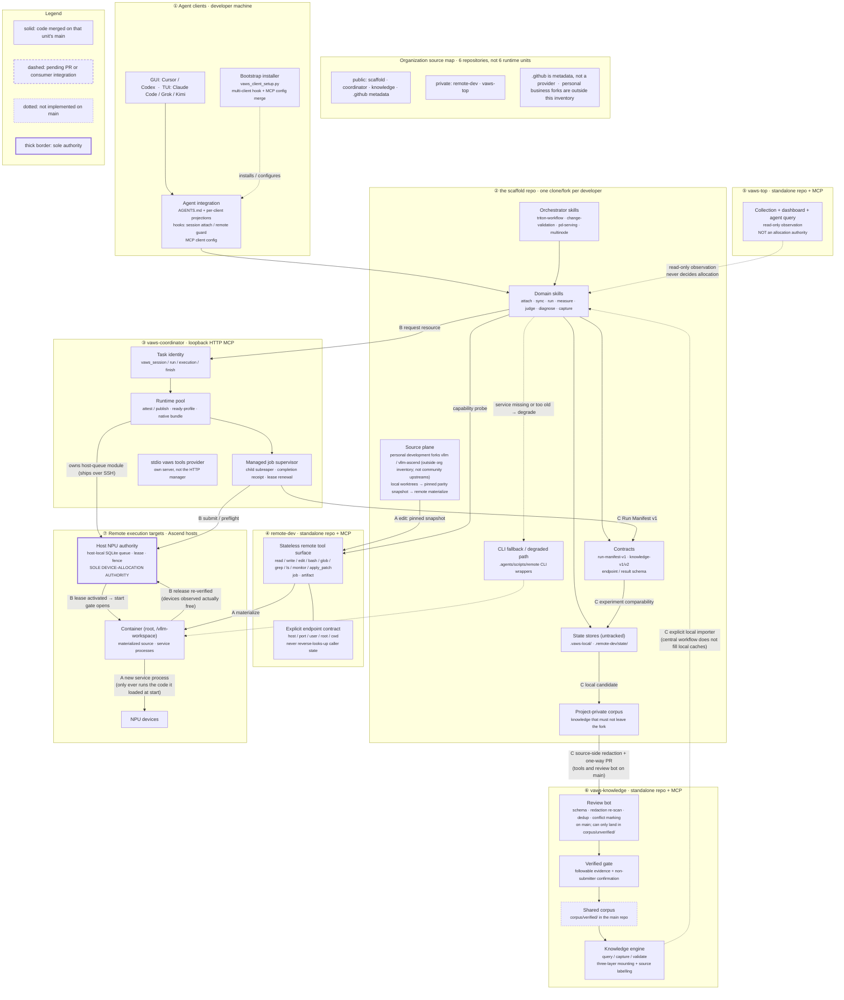

# VAWS architecture map

Target-state map of the `vllm-ascend-workspace` organization, organized by
**deployment unit** — the thing that ships and versions on its own. Layering is
secondary here on purpose: these units are independently released, so "which
unit owns this" is the question a reader actually has.

The fenced `mermaid` block below is the single source of the diagram.

The organization has **six repositories** and **seven deployment units**. Four
are public (scaffold, coordinator, knowledge, `.github`); `remote-dev` and
`vaws-top` remain private. Two personal public development forks sit in the
scaffold source plane outside that inventory. `.github` is organization
metadata, not a provider.

Current source state, exact commits and dated evidence: [source-map.md](source-map.md).

## Deployment units

| # | Unit | Ships as | Runs on |
|---|---|---|---|
| ① | Agent clients + integration | per-developer config from the scaffold bootstrap installer | developer machine |
| ② | The scaffold (`vllm-ascend-workspace`) | one clone/fork per developer | developer machine |
| ③ | `vaws-coordinator` | loopback HTTP MCP; separate stdio `vaws_*` provider; owns the host NPU queue module | loopback or an SSH tunnel |
| ④ | `remote-dev` | stdio MCP server + CLI fallbacks | developer machine, SSH outward |
| ⑤ | `vaws-top` | loopback web UI + API, plus a read-only stdio MCP | developer machine or bastion |
| ⑥ | `vaws-knowledge` | Git repo + knowledge MCP engine; review bot on `main` | GitHub, plus a local engine per consumer |
| ⑦ | Remote execution targets | physical Ascend hosts and their containers | Ascend hardware |

Unit ⑦ is on the map because two of the three flows terminate there and it
holds the one authority nothing else may duplicate. The coordinator's
local-first `vaws_*` provider is its own stdio MCP server, separate from the
loopback HTTP pool manager. Stdio is newline-delimited JSON. Capability
authority is `capabilities.experimental`. The coordinator reaches `remote-dev`
only through explicit endpoint fields.

## Map



`KSHARE` is dotted because the verified corpus is empty.

## The three flows

### A · Edit flow — local edit to a running service

A running service only ever executes the code it loaded at start; every change ends in a new process.

1. **Local worktree.** Edits happen on the developer machine across the scaffold and its `vllm` / `vllm-ascend` worktrees. Personal forks [`maoxx241/vllm`](https://github.com/maoxx241/vllm) and [`maoxx241/vllm-ascend`](https://github.com/maoxx241/vllm-ascend) sit in this source plane outside the organization inventory.
2. **Pinned snapshot.** Parity turns the working tree, including uncommitted edits, into a synthetic commit and publishes Git objects into a container-local cache. Publishing objects is not materializing them.
3. **Materialize.** An explicit step moves the runtime source tree to that snapshot. It neither installs nor compiles.
4. **New service process.** Start a new owned service against the materialized snapshot. Reuse a native build only while its identity still matches.

A remote one-off command is zero-sync and must not go through parity. Editing after launch does not affect the launched service.

### B · Resource flow — agent to an exclusive NPU lease

1. **Agent → coordinator.** A domain skill asks for a resource through `vaws_session` / `vaws_run`. Task identity is local; only remote work needs the manager.
2. **Runtime pool checkout.** The coordinator returns an already-prepared exclusive binding with reserved ports. A cache miss waits; it does not provision, install or compile.
3. **Host NPU authority.** The coordinator owns and versions the host-queue module (`host/vaws_npu_coordination.py`) and ships it over SSH; the module executes on the host. The coordinator submits to the host queue. It does not allocate. The host holds the queue, the lease and the fence.
4. **Lease → start gate.** The manager prepares a waiting supervisor, verifies its host PID, activates the host lease, then opens the start gate.
5. **Verified release.** Stop only the recorded process family. The host must observe every leased device free across repeated samples before reuse. Unknown ownership retains resources; a client timeout is never cleanup.

Fail-closed: a supervisor that vanishes without a completion receipt leaves the execution `unknown` and the lease protected until ownership is reconciled.

### C · Evidence flow — a run to a fact somebody else can reuse

1. **Run → Run Manifest v1.** Every cross-workflow run emits a manifest under untracked local state. A released allocation is not a passing run.
2. **Manifest → comparability.** Manifests carry environment and source identity. Two results that differ in more than one dimension cannot be attributed to either.
3. **Candidate.** A confirmed fix is captured locally, then into the fork's project layer.
4. **Redact at the source, then one PR.** Redaction runs in the contributing fork before the PR. The schema is the egress whitelist (`additionalProperties: false`); the main repo re-scans second.
5. **Bot, then a human.** The bot gates schema, redaction, duplicates, conflicts and id/hash integrity. It cannot decide whether a claim is true, so bot approval only reaches `corpus/unverified/`. `corpus/verified/` needs followable evidence and a non-submitter confirmation.
6. **Back into queries.** A central workflow does not fill another developer's local cache. The consumer is the explicit local importer (`.agents/scripts/knowledge_shared_cache.py import --from ... --source-repo ... --source-ref ...`). Results are labelled by layer; stale entries warn.

Forks propose upward; the main repo publishes downward. There is no merge algorithm.

## Trust boundaries

| Boundary | Where | Property |
|---|---|---|
| Loopback-only services | ③ `vaws-coordinator` (loopback, bearer token per principal, Host/Origin checks on), ⑤ `vaws-top` (web + API on loopback, **no login**) | Neither is safe to expose. Remote access is authenticated SSH forwarding. |
| SSH + remote root | ④ → ⑦ | `remote-dev` defaults to `root=/`. Containers run as root at `/vllm-workspace`. Narrow `root` is opt-in. |
| Cooperative fence | ③ and the host queue | Enforced only for participants. Direct SSH, unmanaged containers and plain remote-dev writes are outside it. |
| Public, unrecallable | ⑥'s PR entrance | Public Git history cannot be recalled. Redaction is a source-side gate; widening a schema object is a privacy decision. |
| Secrets never in tracked files | all units | Tokens, inventories and monitor keys live in untracked local state, mode `0600` where applicable. `vaws-top` passes a bootstrap password on stdin for one request and stores it nowhere. |

## Service contract

Every provider repository (`remote-dev`, `vaws-coordinator`, `vaws-top`, `vaws-knowledge`) commits `service-api.json` `{"schema_version":1,"name":…,"service_api_version":N,"supports":[…]}` and advertises the same integer in the MCP `initialize` result under `capabilities.experimental[name].service_api_version`. The scaffold pins each provider by commit and declares an accepted `service_api` range. Pin drift warns; an incompatible API degrades that capability and names a remedy. Neither condition blocks local execution.

## Authority rules

1. **The host NPU queue is the sole device-allocation authority.** It lives on each physical Ascend host and owns tasks, queue, fences, activation and release. The coordinator submits and waits; it does not allocate. The legacy session-local lease file is a compatibility mechanism, not a second allocator. A monitor never kills, leases, or releases devices.
2. **`vaws-top` is observation-only and must never decide an allocation.** It is a read-only collector. Its "idle" answer is a cache with an age. An idle reading does not reserve a device.
3. **An MCP fence is a cooperative mechanism, not an OS access-control boundary.** It cannot stop a process, and accepting a yield does not release a device. Coordination messages are untrusted text.
4. **Contract ownership follows the unit.** The unit that defines a schema owns it. `remote-dev` owns the endpoint/result contract; the coordinator owns task and execution contracts; the coordinator owns the host-queue protocol and module; the scaffold consumes it from the coordinator checkout; the scaffold owns Run Manifest v1; `vaws-knowledge` owns the knowledge schema. A consumer does not extend a producer's contract in its own repo.
5. **Dependency direction is one-way.** `remote-dev` is stateless and accepts explicit endpoint fields only. Workspace / session / alias discovery belongs in the consumer resolver plugin. The coordinator consumes `remote-dev`, never the reverse. The scaffold consumes the coordinator; the coordinator does not import scaffold code at runtime.

## Out of scope

- **Multi-host gang allocation.** Multi-host work is sequenced by the caller and can partially acquire.
- **Runtime pool auto-replenishment.** A cache miss surfaces as a miss. Nothing builds, installs or compiles inside a launch path.
- **Public OAuth / internet-facing authorization.** The coordinator is a private cooperative loopback service. `vaws-top` has no login.
- **Bidirectional knowledge merge.** Forks never write `verified/`; the main repo never writes into a fork.

Also absent: transparent adapters for every legacy domain wrapper, relocatability of editable installs and native operator artifacts, and treating a released allocation as a passing run.

## Verifying the diagram

The fenced `mermaid` block above is the source. To check it renders after an edit:

```bash
awk '/^```mermaid$/{f=1;next} /^```$/{f=0} f' docs/architecture.md > /tmp/arch.mmd
npx -y @mermaid-js/mermaid-cli -i /tmp/arch.mmd -o /tmp/arch.svg
```

Treat a render failure as a blocking error on the PR.
