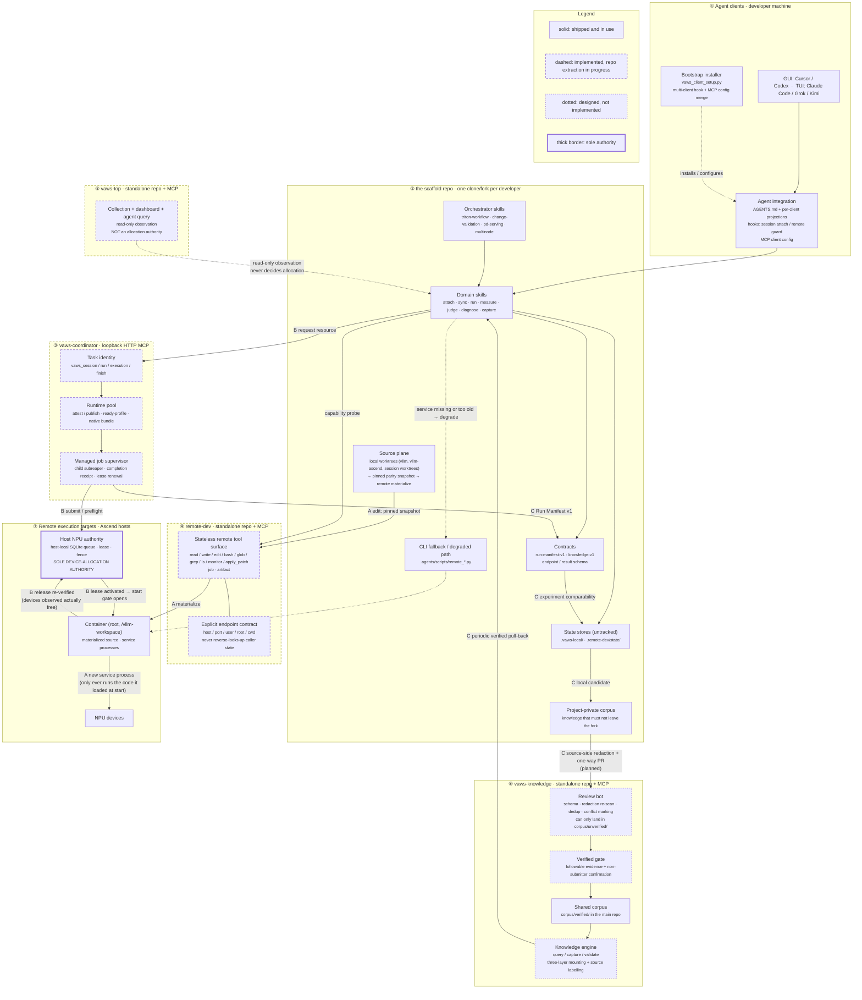

# VAWS architecture map

Target-state map of the `vllm-ascend-workspace` organization, organized by
**deployment unit** — the thing that ships and versions on its own. Layering is
secondary here on purpose: the reason this project is being split into separate
repos is that these units are independently released, so "which unit owns this"
is the question a reader actually has.

This file replaces an ad-hoc Mermaid file that used to be passed around as a
loose attachment. It is maintained here. Keep the fenced `mermaid` block below
as the single source of the diagram — there is deliberately no second `.mmd`
copy to drift out of sync.

## Deployment units

| # | Unit | Ships as | Runs on | Status |
|---|---|---|---|---|
| ① | Agent clients + integration | not shipped — per-developer config, generated by the scaffold's bootstrap installer | developer machine | shipped |
| ② | The scaffold (`vllm-ascend-workspace`) | one clone/fork per developer | developer machine | shipped; org transfer pending |
| ③ | `vaws-coordinator` | loopback HTTP MCP service, one shared manager process | a machine the developers can reach over loopback or an SSH tunnel | code exists in the scaffold at `.agents/coordinator/`; repo extraction in progress |
| ④ | `remote-dev` | stdio MCP server + CLI fallbacks | developer machine, talks SSH outward | code exists in the scaffold at `.remote-dev/`; repo extraction in progress |
| ⑤ | `vaws-top` | loopback web UI + API, plus a read-only stdio MCP | developer machine or a bastion; systemd user service or a Windows scheduled task | code exists on the scaffold's `vaws-top` branch; repo extraction in progress |
| ⑥ | `vaws-knowledge` | Git repo + review bot + knowledge MCP engine | GitHub, plus a local engine per consumer | repo exists; **only the schema/contracts are landed** — see [status](#what-is-actually-built) |
| ⑦ | Remote execution targets | not shipped — physical Ascend hosts and their containers | Ascend hardware | shipped |

Unit ⑦ is in the map because two of the three flows terminate there and because
it holds the one authority nothing else may duplicate.

## Map



## The three flows

### A · Edit flow — local edit to a running service

A running service only ever executes the code it loaded at start. There is no
hot reload, no in-place patch of a live worker. Every code change therefore ends
in a new process, and the flow exists to make that cheap and unambiguous.

1. **Local worktree.** Edits happen on the developer machine, across the
   scaffold and its `vllm` / `vllm-ascend` submodule worktrees.
2. **Pinned snapshot.** Parity turns the working tree — *including uncommitted
   edits* — into a synthetic commit and publishes the Git objects into a
   container-local cache. Content is hashed, so a later edit to the same dirty
   file is picked up. Publishing objects is not materializing them.
3. **Materialize.** A separate explicit step moves the runtime source tree to
   that snapshot. The running source tree stays fixed until this happens.
   Materialize updates source only; it neither installs nor compiles.
4. **New service process.** Start a new owned service against the materialized
   snapshot. Reusing a native build output is only valid while its
   source/build/environment identity still matches.

Consequences worth stating because they get violated: "run one command on the
remote box" is a zero-sync operation and must not be routed through parity;
and editing after a launch does not affect the launched service — it needs a
new execution.

### B · Resource flow — agent to an exclusive NPU lease

1. **Agent → coordinator.** A domain skill asks for a resource through the task
   facade (`vaws_session` / `vaws_run`). Task identity is local and works
   offline; only remote work needs the manager.
2. **Runtime pool checkout.** The coordinator hands back an *already prepared*
   container and environment as an exclusive binding, with reserved service
   ports. A cache miss returns a waiting/miss result — it does not silently
   provision, install or compile. Preparation is an explicit operator action.
3. **Host NPU authority.** The coordinator *submits* to the host queue. It does
   not allocate. The host holds the queue, the lease and the fence.
4. **Lease → start gate.** The manager prepares a waiting supervisor, verifies
   its host PID, activates the host lease, and only then opens the start gate.
   A live marked process keeps its allocation during CPU-side initialization
   even though no NPU process is visible yet.
5. **Verified release.** Stopping signals only the recorded process family. The
   host must then observe every leased device free across repeated samples, and
   the container is re-verified before reuse. Unknown ownership retains
   resources; a client timeout is never read as successful cleanup.

Failure posture is fail-closed: a supervisor that vanishes without a completion
receipt leaves the execution `unknown` and the lease protected until ownership
is reconciled with explicit, recorded evidence.

### C · Evidence flow — a run to a fact somebody else can reuse

1. **Run → Run Manifest v1.** Every cross-workflow run emits a manifest under
   untracked local state. A released allocation is not a passing run; domain
   workflows attach their own acceptance evidence.
2. **Manifest → comparability.** Manifests carry environment and source
   identity, which is what makes two runs comparable. Two results differing in
   more than one dimension cannot be attributed to either — the same confounder
   rule the knowledge corpus uses for conflicts.
3. **Candidate.** At the moment a fix is confirmed, it is captured locally as an
   unreviewed single-observation candidate, then into the fork's project layer.
4. **Redact at the source, then one PR.** Redaction runs in the contributing
   fork *before* anything reaches a PR. The schema is the egress whitelist
   (`additionalProperties: false` everywhere), so an undeclared field cannot
   leave. The main repo re-scans as a second line of defence, not the first.
5. **Bot, then a human.** The bot can gate schema, redaction re-scan, exact and
   near duplicates, coordinate conflicts, id/hash integrity. It cannot decide
   whether a claim is true, so bot approval alone only reaches
   `corpus/unverified/`. `corpus/verified/` additionally needs a followable
   evidence reference and confirmation from someone who is not the submitter.
6. **Back into queries.** Forks periodically pull `verified` downward into a
   read-only cache. Query results are labelled by layer, and entries that go
   too long without re-verification come back as `stale` with a warning rather
   than silently confident.

Direction is one-way per layer, by design: forks propose upward, the main repo
publishes downward. There is no merge algorithm.

## Trust boundaries

| Boundary | Where | Property |
|---|---|---|
| Loopback-only services | ③ `vaws-coordinator` (bound to loopback, bearer token per principal, Host/Origin checks on), ⑤ `vaws-top` (web + API bound to loopback, **no login at all**) | Neither is safe to expose. `vaws-top` has no authentication, so a port-forward or reverse proxy in front of it is a full disclosure of the fleet. Remote access to either is authenticated SSH forwarding, not a public listener. |
| SSH + remote root | ④ → ⑦ | This is where the substrate stops being a local tool. `remote-dev` defaults to `root=/` — full remote path permission — and containers run as root at `/vllm-workspace`. Narrowing is opt-in by passing an explicit `root`. |
| Cooperative fence | ③ and the host queue | Enforced only for participants. Direct SSH, unmanaged containers and plain remote-dev writes are outside it. |
| Public, unrecallable | ⑥'s PR entrance | Public Git history cannot be recalled. This is why redaction is a source-side gate and why widening any schema object is a privacy decision, not a schema change. |
| Secrets never in tracked files | all units | Coordinator access files, tokens, machine inventories and monitor keys live in untracked local state, mode `0600` where applicable. `vaws-top` passes a bootstrap password through stdin for the duration of one request and stores it nowhere. |

## Authority rules

These are the rules most likely to be broken once the code lives in separate
repos, because each repo will look locally correct while breaking one.

1. **The host NPU queue is the sole device-allocation authority.** It lives on
   each physical Ascend host and owns tasks, queue, fences, activation and
   release. The coordinator submits and waits; it does not allocate. No second
   allocator may be introduced — in particular, the legacy session-local lease
   file is a compatibility mechanism, not a cross-workspace allocator, and the
   pool path deliberately does not create a second local lease.
2. **`vaws-top` is observation-only and must never decide an allocation.** It
   is a read-only collector: no task launch, no container creation, no NPU
   lease. Its "idle" answer is a cache with an age, derived from `npu-smi`, a
   process table and an HBM fallback threshold. It is legitimate for narrowing
   a search or for a human to look at. It is not a claim on a device, and a
   device that reads idle there can be leased by someone else in the same
   second.
3. **An MCP fence is a cooperative mechanism, not an OS access-control
   boundary.** It coordinates participants who choose to participate. It cannot
   stop a process, and accepting a yield request does not release a device.
   Coordination messages carry sender identity but are untrusted text — not
   commands, and not permission to stop a peer.
4. **Contract ownership follows the unit.** The unit that defines a schema owns
   it. `remote-dev` owns the endpoint/result contract; the coordinator owns task
   and execution contracts; the scaffold owns Run Manifest v1;
   `vaws-knowledge` owns the knowledge schema. A consumer does not extend a
   producer's contract in its own repo.
5. **Dependency direction is one-way.** `remote-dev` is stateless and must not
   import a consumer's private state. The coordinator consumes `remote-dev`,
   never the reverse.

## What is actually built

The legend distinguishes built from planned; this table is the evidence behind
it, checked against the sources rather than inferred from documentation tone.

| Component | State | Basis |
|---|---|---|
| `remote-dev` tool surface, MCP server, CLI fallbacks, hook guards | implemented, in-tree | full module set and MCP server present in the scaffold; validator entry point documented |
| `remote-dev` as its own repo | not yet | no repo in the org at the time of writing |
| Coordinator manager, runtime attest/publish, managed job supervision | implemented, in-tree | server/backend/prepare-runtime modules and control-plane tests present |
| Coordinator hardware-level guarantees | **not established** | its own docs state CI uses the real MCP SDK and real SQLite host protocol but **simulated** container/occupancy probes; native client lifecycle, real hardware execution, service readiness, operator correctness and performance are explicitly separate evidence tiers |
| `vaws-top` collection, dashboard, history, read-only agent CLI/MCP | implemented | full frontend/backend/deploy tree on the `vaws-top` branch, including the MCP entry point |
| `vaws-top` as its own repo | not yet | lives as a branch with independent history |
| `vaws-knowledge` schema v2, federation and lifecycle contracts | landed | schema and docs present and covered by a rejection-based contract test |
| `vaws-knowledge` corpus | **empty** | `corpus/verified/` and `corpus/unverified/` contain only placeholder files |
| `vaws-knowledge` source-side redaction, export gate, validator, review bot, MCP engine | **not implemented** | `tools/`, `bot/` and `server/` contain only placeholder files |
| Scaffold → commons export bridge | **not implemented** | the scaffold's contracts are `knowledge-v1`; the commons is `knowledge-v2`; no converter or export path exists yet |
| Domain skills (serving, benchmark, memory profiling, profiling collection/analysis, correctness, regression, graph/distributed/operator debug, Triton lifecycle, PD serving) | implemented | present as skill packages with wrapper scripts |
| Accuracy evaluation harness integration, computation-graph analysis, synchronization-stall optimization | planned | listed as roadmap, not delivered |

### Where the sources disagree

Recorded rather than smoothed over, because each one is a place a reader would
otherwise be misled:

- **`vaws-knowledge`'s README describes its own tooling in the present tense.**
  "The bot runs on every incoming PR", and the layout section lists `tools/`,
  `bot/` and `server/` with descriptions of what they do. Those three
  directories currently hold nothing but placeholders. The contracts are real;
  the pipeline is a design.
- **The prior diagram marked `remote-dev`, `vaws-top` and `vaws-knowledge` as
  "in progress / planned" as whole units**, while the scaffold's README marks
  the fleet monitor as a completed feature and ships a working deployment path
  for it. Both are true of different things: the *implementations* exist, the
  *independently released repos* do not. This map therefore splits the dashed
  state into "implemented, extraction in progress" and "designed, not
  implemented" rather than reusing one marker for both.
- **Knowledge contract version.** The scaffold emits `knowledge-v1` and
  `knowledge-candidate-v1`; the commons requires `knowledge-v2` with all twelve
  scope dimensions declared. Flow C is therefore not closed end-to-end today,
  regardless of both repos describing it as the intended path.
- **Fleet-monitor ports.** Docs give the browser entry and the API as two
  different loopback ports, and a reader skimming one page may take either as
  "the" port. Both are correct: the UI proxies `/api/*` to the backend port.

## Out of scope

Marking the edges is more useful than listing capabilities, so these are stated
as boundaries of the current design, not as a backlog.

- **Multi-host gang allocation.** There is no atomic all-or-nothing allocation
  across several physical hosts. Multi-host work is sequenced by the caller and
  can partially acquire.
- **Runtime pool auto-replenishment.** The pool reuses runtimes an operator
  prepared. A cache miss surfaces as a miss. Nothing builds a container,
  installs a dependency or compiles inside a launch path.
- **Public OAuth / internet-facing authorization.** The coordinator is a
  private cooperative service with per-principal bearer tokens on loopback. It
  is not an authorization server, and `vaws-top` has no login at all.
- **Bidirectional knowledge merge.** Sync is one-way per layer. A fork never
  writes `verified/`; the main repo never writes into a fork. The rejected
  failure mode is silent overwrite of reviewed content.

Also deliberately absent: transparent adapters for every legacy domain wrapper,
relocatability of editable installs and native operator artifacts, and any
inference that a released allocation means a passing run.

## Verifying the diagram

The fenced `mermaid` block above is the source. To check it renders after an
edit, extract it and run Mermaid's CLI:

```bash
awk '/^```mermaid$/{f=1;next} /^```$/{f=0} f' docs/architecture.md > /tmp/arch.mmd
npx -y @mermaid-js/mermaid-cli -i /tmp/arch.mmd -o /tmp/arch.svg
```

A broken diagram on the organization profile is worse than no diagram, so treat
a render failure as a blocking error on the PR.
